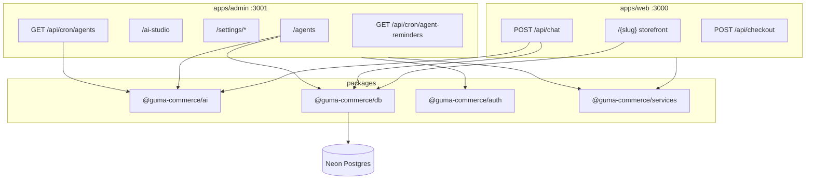

# Guma Commerce — Agent Handoff Document

**Last updated:** 2026-07-05  
**Purpose:** Hands-off context for the next agent or developer. Read this before making changes.

> **Newest work is documented in [Session 2026-07-05](#session-2026-07-05--brand-redesign--platform-super-admin-console) immediately below.** Sections 1–21 remain the durable reference for the core platform (agents, AI, settings, DB). Where they conflict with the 2026-07-05 session, the session wins.

---

## Session 2026-07-05 — Brand redesign + Platform (super-admin) console

### 1. Project overview (delta)
Three Next.js 15 (App Router, React 19) apps now exist in the `pnpm`+Turbo monorepo, all sharing `packages/*`:

| App | Path | Port | Role |
|-----|------|------|------|
| Storefront + marketing | `apps/web` | 3000 | `/{tenantSlug}` shops, checkout, buyer chat |
| Seller admin | `apps/admin` | 3001 | Per-tenant dashboard (one shop) |
| **Platform console (NEW)** | `apps/platform` | 3002 | **Super-admin over ALL tenants** |

Stack unchanged: TypeScript, Tailwind v3, Drizzle ORM → **Neon Postgres** (live, Singapore), JWT cookie auth (`jose`, cookie `sari_session`) in `packages/auth`, `bcryptjs` passwords. AI providers + PayMongo/Lalamove/Semaphore unchanged. Deployment target: Vercel (one project per app).

### 2. What was built this session
1. **Guma brand system ported into `apps/admin`** — the emerald/amber HSL design tokens, Bricolage Grotesque + Plus Jakarta Sans fonts, `hero-glow`/grid utilities, and animations from `apps/web` (landing redesign, commit `5facdd1`). Admin sidebar/header/dashboard redesigned with lucide icons (replacing violet theme + emoji nav).
2. **Seller storefront polish** — fixed off-brand violet in owner menu, accent-tinted checkout button, rebranded the "shop being set up" pending page, friendlier empty catalog state.
3. **`apps/platform` — a brand-new super-admin console** (the bulk of the session). Distinct dark-emerald sidebar to differentiate from the seller admin. Surfaces: Dashboard (MRR/GMV/shops/users KPIs + SVG revenue/signup charts + plan/status bars), Tenants (filterable list → detail with suspend/activate/set-pending/change-plan/view-storefront), Subscriptions (plan catalog + MRR/ARR/ARPU + per-shop plan mgmt), Users (role change + suspend/reactivate), Moderation (`content_queue` approve/reject/flag), Orders (platform-wide), Audit Log.
4. **DB schema additions** (see §4) + seeded a `super_admin`.

### 3. Files created / modified

**New — `apps/platform/` (entire app):**
- Config: `package.json`, `next.config.ts`, `tsconfig.json`, `tailwind.config.ts`, `postcss.config.mjs`, `next-env.d.ts`, `middleware.ts`
- `app/`: `globals.css`, `layout.tsx`, `page.tsx` (dashboard), `login/page.tsx`, `actions.ts` (server actions for all mutations), `tenants/page.tsx`, `tenants/[id]/page.tsx`, `subscriptions/page.tsx`, `users/page.tsx`, `moderation/page.tsx`, `orders/page.tsx`, `audit/page.tsx`, `api/auth/{login,logout,session}/route.ts`
- `components/`: `platform-shell.tsx`, `ui.tsx` (StatCard/StatusPill/PlanBadge/AreaChart/BarMeter/EmptyState/Panel), `login-form.tsx`, `filter-bar.tsx` (URL-synced), `tenant-actions.tsx`, `user-actions.tsx`, `plan-select.tsx`, `moderation-actions.tsx`
- `lib/`: `session.ts` (`requireSuperAdmin`), `api-auth.ts` (`requireSuperAdminApi`), `format.ts`, `plans.ts` (**client-safe** plan catalog — see pitfall in §6)

**New — db package:** `packages/db/src/queries/platform.ts` (all platform reads/writes + `PLATFORM_PLANS` catalog).

**Modified:**
- `packages/db/src/schema/index.ts` — added `users.status`, `content_queue` moderation cols, `platform_audit_log` table.
- `packages/db/src/index.ts` — re-export platform queries/types.
- `apps/admin/app/{globals.css,layout.tsx}`, `apps/admin/tailwind.config.ts`, `apps/admin/components/{admin-shell,dashboard-view}.tsx` — brand redesign.
- `apps/web/app/[tenantSlug]/page.tsx`, `apps/web/components/storefront/{shop-shell,shopify-catalog}.tsx` — storefront polish.

> ⚠️ The working tree also has **unrelated uncommitted changes from a prior session** (orders manager, cart, checkout/paymongo, `packages/db/src/queries/orders.ts`, etc.). Those were **not** touched this session — don't attribute or bundle them blindly.

### 4. Database changes (APPLIED to live Neon)
Applied via a **surgical idempotent SQL script** (`ADD COLUMN IF NOT EXISTS` / `CREATE TABLE IF NOT EXISTS`) — **NOT** `drizzle-kit push`, which failed trying to drop/rebuild a pre-existing primary key (`column "id" is in a primary key`). **Do not run `db:push` against this DB** — use targeted SQL or a proper generated migration.

Added:
- `users.status varchar(20) NOT NULL DEFAULT 'active'` — values `active | suspended`.
- `content_queue`: `flagged bool NOT NULL DEFAULT false`, `moderation_note text`, `moderated_by uuid → users`, `moderated_at timestamptz`, + `content_queue_flagged_idx`.
- New table `platform_audit_log` (id, actor_id, actor_email, action, entity_type, entity_id, entity_label, metadata_json, created_at) + 3 indexes.

**Schema drift note:** these are in `schema/index.ts` but **no drizzle migration file was generated** — the DB and schema agree, but `packages/db/drizzle/` is behind. Next agent should `pnpm db:generate` and reconcile before the next real migration.

### 5. Auth for the platform console
- Login: **`admin@guma.ph` / `GumaAdmin2026!`** (seeded super_admin; change before any shared/prod use).
- Only `role === 'super_admin'` may enter — enforced in `apps/platform/middleware.ts` AND `app/api/auth/login/route.ts`. Reuses the shared `sari_session` cookie + `packages/auth` token helpers (no changes to `packages/auth`).
- All mutations run through **server actions** in `app/actions.ts`, each guarded by `requireSuperAdminApi()` and writing a `platform_audit_log` row + `revalidatePath`.

### 6. Critical pitfalls / decisions
- **Client components must NOT import from `@guma-commerce/db`.** The package barrel pulls `client.ts` → `postgres` → node `net`, which breaks the browser bundle (`Can't resolve 'net'`) and 500s *every* page. This is why the client-side plan list lives in `apps/platform/lib/plans.ts` (mirror of `PLATFORM_PLANS`; keep in sync). Server components/actions import from `@guma-commerce/db` freely.
- **Plan catalog inconsistency (tech debt):** `PLATFORM_PLANS` (db) defines `free/starter/growth/pro` at ₱0/499/1499/2999. This differs from `packages/ai/src/plan-limits.ts` (`free/growth/pro`) and the marketing pricing (Pro was ₱999). MRR/ARR/ARPU on the Subscriptions page derive from `PLATFORM_PLANS`. **Reconcile these three sources before wiring real billing.**
- Charts are dependency-free inline SVG (`AreaChart`, `BarMeter` in `components/ui.tsx`) — no chart lib added.
- Pages are **server components** (direct query calls, no client fetch/loading states) + server actions for writes — the modern idiom, differs from `apps/admin`'s client-fetch+API-route pattern.

### 7. Verification done
- `tsc --noEmit` clean: `apps/platform` and `packages/db`.
- Platform dev server (port 3002) compiles; all 7 routes return 200 with live data (MRR ₱2,999 from 1 Pro shop; 4 shops; 4 users).
- End-to-end mutation tested: activated a pending tenant → status flipped + success toast + audit-log row with actor/label. **Test change was reverted** (tenant back to `pending`, test audit row deleted) — live data is clean.
- Not yet run: `next build` (production) for `apps/platform`; no automated tests exist.

### 8. Pending / recommended next steps (this session's scope)
- **High:** `pnpm db:generate` to create the migration file for the schema additions (DB is ahead of `drizzle/`).
- **High:** Reconcile the 3 plan-price sources (§6) before billing.
- **Medium:** `next build` the platform app; add it to CI/Vercel (new project, port 3002, same monorepo build command, needs `AUTH_SECRET` + `DATABASE_URL*`).
- **Medium:** Enforce `users.status='suspended'` and `tenants.status='suspended'` at the **seller** login/storefront layer (platform can suspend, but `apps/admin`/`apps/web` don't yet block suspended accounts/shops).
- **Low:** Moderation currently only covers `content_queue`; extend to products if needed. Add pagination to platform tables (currently limit 200–500).
- **Housekeeping:** Nothing from this session is committed. A launch config for the platform app exists at `D:\All Apps\guma-phase1.2\.claude\launch.json` (name `gumacommerce-platform`).

### 9. Next-agent quick start (platform work)
```cmd
cd C:\Users\samga\gumacommerce
pnpm install
pnpm --dir apps/platform exec next dev   # → http://localhost:3002, login admin@guma.ph / GumaAdmin2026!
pnpm --dir apps/platform exec tsc --noEmit
```
Inspect first: `apps/platform/app/actions.ts`, `packages/db/src/queries/platform.ts`, `apps/platform/components/platform-shell.tsx`, `apps/platform/lib/plans.ts`. **Warning:** never import `@guma-commerce/db` from a `"use client"` file; never run `db:push`.

### 10. Recommended next prompt (paste to continue)
> You're working in the `guma-commerce` pnpm+Turbo monorepo at `C:\Users\samga\gumacommerce`. Read `docs/AGENT-HANDOFF.md` (Session 2026-07-05 first). Three Next.js 15 apps: `web` (3000), `admin` (3001), and the new super-admin `platform` (3002, login `admin@guma.ph`/`GumaAdmin2026!`). A prior session added `apps/platform`, `packages/db/src/queries/platform.ts`, and DB schema (`users.status`, `content_queue` moderation cols, `platform_audit_log`) already applied to live Neon — but **no drizzle migration file was generated**. Your tasks, in order: (1) run `pnpm db:generate` and reconcile so `packages/db/drizzle/` matches the live DB; (2) reconcile the three conflicting plan-price sources — `PLATFORM_PLANS` in `packages/db/src/queries/platform.ts`, `packages/ai/src/plan-limits.ts`, and marketing pricing — into one source of truth; (3) make `apps/admin` (seller login) and `apps/web` (storefront) respect `users.status='suspended'` and `tenants.status='suspended'`. Constraints: never import `@guma-commerce/db` from a `"use client"` component (it pulls the Postgres driver and 500s the page — keep client plan data in `apps/platform/lib/plans.ts`); never run `db:push` against this DB (it fails on a pre-existing PK). Verify with `pnpm --dir apps/platform exec tsc --noEmit` and by loading the affected pages. Don't commit unless asked.

---

## 1. Product summary

**Guma Commerce** (formerly scaffolded as “SariLink”) is an AI-powered social commerce platform for Philippine sellers.

| Surface | Path | Port | Role |
|---------|------|------|------|
| Storefront | `apps/web` | 3000 | Marketing site + `/{tenantSlug}` shops, checkout, shop assistant chat |
| Admin | `apps/admin` | 3001 | Seller dashboard, settings, AI Studio, Agents, products/orders |
| Platform | `apps/platform` | 3002 | Super-admin over all tenants (added 2026-07-05 — see top session) |

**Core value:** Turn social traffic into a branded mobile storefront with GCash/Maya/COD, delivery stubs, AI content, and agentic daily posting workflows.

**Buyer chatbot** = pre-checkout assistant on storefront (`POST /api/chat`).  
**WhatsApp Agent** (Settings) = seller business number config — not the same as buyer chat.

---

## 2. Repository state (as of handoff)

| Item | Status |
|------|--------|
| **Local folder** | `C:\Users\samga\gumacommerce` (active repo; pushes work here) |
| **Git** | Branch `master`; latest commit `5facdd1` (landing redesign). 2026-07-05 work is **uncommitted** in the working tree |
| **npm scope** | `@guma-commerce/*` (rebrand complete in source) |
| **Root package name** | `guma-commerce` |
| **Production deploy** | Not done — docs ready in `docs/DEPLOY-VERCEL.md` |
| **DB (Neon)** | Migrations `0000` + `0001` applied; `pnpm db:reconcile` run once to fix partial `db:push` drift |
| **Build** | `pnpm turbo build --filter=@guma-commerce/web --filter=@guma-commerce/admin` passes |

---

## 3. Monorepo layout

```
guma-commerce/                    # (folder may still be named sari-link)
├── apps/
│   ├── web/                     @guma-commerce/web
│   └── admin/                   @guma-commerce/admin
├── packages/
│   ├── ai/                      @guma-commerce/ai      — prompts, generator, plan limits, LLM router
│   ├── auth/                    @guma-commerce/auth     — sessions, Google OAuth, signup
│   ├── db/                      @guma-commerce/db       — Drizzle schema, migrations, queries
│   ├── services/                @guma-commerce/services — PayMongo, Lalamove, Semaphore SMS
│   ├── storefront-themes/       @guma-commerce/storefront-themes
│   ├── ui/                      @guma-commerce/ui       — shared Button, Card, Badge, etc.
│   └── media/                   @guma-commerce/media    — (minimal / stub)
├── docs/
│   ├── AGENT-HANDOFF.md         ← this file
│   ├── DATABASE.md
│   └── DEPLOY-VERCEL.md
├── docker-compose.yml           — local Postgres on port 5434, DB name `guma_commerce`
├── .env.example
└── turbo.json
```

---

## 4. Brand & naming conventions

| Context | Use |
|---------|-----|
| User-facing product | **Guma Commerce** |
| Company | Guma Commerce Technologies (`apps/web/lib/site-content.ts`) |
| npm packages | `@guma-commerce/*` |
| Subscription plan IDs (DB) | `free`, `growth`, `pro` |
| Marketing / UI plan names | **Sulit** (free), **Growth**, **Pro** |
| Shop URL display | `{NEXT_PUBLIC_ROOT_DOMAIN}/{slug}` — default host `gumacommerce.ph` |
| Emails | `hello@gumacommerce.ph`, `support@gumacommerce.ph`, `privacy@gumacommerce.ph` |

**Do not reintroduce:** SariLink, SariPro, SariBiz, sari.link, @sari-link, sarilink.ph.

**Internal globals (DB client):** `__gumaCommerceDb`, `__gumaCommerceSql` in `packages/db/src/client.ts`.

---

## 5. Architecture (high level)



---

## 6. Database

**ORM:** Drizzle · **Production:** Neon (Singapore) · **Local:** Docker Postgres `:5434`.

### Migrations (use these, not `db:push` in prod)

| File | Contents |
|------|----------|
| `packages/db/drizzle/0000_slippery_ultimates.sql` | Core schema (tenants, products, orders, …) |
| `packages/db/drizzle/0001_sweet_mandroid.sql` | Agent tables + enums |

### Agent-related tables (0001)

- `content_queue` — drafted/approved/scheduled/posted social content
- `agent_runs` — run history
- `shop_chat_messages` — buyer chat logs
- `ai_usage_monthly` — quota tracking per tenant/month

### Key queries

| Module | Path |
|--------|------|
| Agents CRUD | `packages/db/src/queries/agents.ts` |
| AI usage counts | `packages/db/src/queries/ai-usage.ts` |
| Order insights (7d) | `packages/db/src/queries/order-insights.ts` |
| Tenant settings types | `packages/db/src/types/tenant-settings.ts` |

### Migration gotcha

A prior `db:push` partially applied agent schema before failing. Fix:

```cmd
pnpm db:reconcile   # if agent tables exist but 0001 not in journal
pnpm db:migrate
```

Inspect DB state: `pnpm db:inspect`.

### Env URL resolution

`packages/db/src/env.ts` supports:

- **Neon + Vercel:** `DATABASE_URL` (pooled), `DATABASE_URL_UNPOOLED` (direct)
- **Local .env:** `DATABASE_URL` (direct), `DATABASE_URL_POOLED` (pooled)

---

## 7. Agents system

### Admin UI — `/agents`

`apps/admin/components/agents-manager.tsx`

- Content queue (approve / skip / copy / mark posted)
- Schedule config (daily/weekly/manual, channels, time)
- Shop assistant settings
- **Daily briefing** — rule-based, grounded in `getOrderInsightsLast7d`
- Usage meters vs plan limits
- Content calendar

### Run agents (manual)

`POST /api/agents/run` — body `{ agentKey: "posting" | "campaign" | "all" }`  
Gated by `assertAiQuota` in `apps/admin/lib/agents/usage-gate.ts`.

### Cron (admin only)

Configured in `apps/admin/vercel.json`:

| Schedule (UTC) | Path | Purpose |
|----------------|------|---------|
| `0 10 * * *` | `/api/cron/agents?mode=daily` | Daily posting agent (~6 PM PHT) |
| `0 2 * * 1` | `/api/cron/agents?mode=weekly` | Weekly campaign agent |
| `0 9 * * *` | `/api/cron/agent-reminders` | SMS nudge (Growth+ only) |

Requires `CRON_SECRET` on admin Vercel project. Cron routes also enforce plan quotas.

### Order-aware prompts

`apps/admin/lib/agents/run-agents.ts` uses bestsellers + 7-day order insights in prompts.

### Not built (Phase 2+)

- Meta/TikTok OAuth auto-publish
- Unified Messenger/IG inbox
- LLM-generated briefing (currently rule-based)

---

## 8. AI package

**Path:** `packages/ai/`

| File | Role |
|------|------|
| `src/plan-limits.ts` | `PLAN_AI_LIMITS`, `checkQuota`, `resolveModelForTask` |
| `src/providers/llm.ts` | OpenAI, Gemini, Groq, mock fallback |
| `src/generator.ts` | Template-based generation with plan routing |

### Plan limits (summary)

| Plan | Agent runs/week | Chat/day | Generations/mo | SMS reminders | Models |
|------|-----------------|----------|----------------|---------------|--------|
| free (Sulit) | 3 | 25 | 5 | No | gemini-2.0-flash |
| growth | 14 (2/day cap) | 200 | 100 | Yes | gpt-4o-mini |
| pro | 999 (10/day cap) | 2000 | 500 | Yes | gpt-4o-mini posts, gpt-4o campaigns |

**Env for live AI:** `OPENAI_API_KEY`, `GEMINI_API_KEY` (or `GOOGLE_AI_API_KEY`), optional `GROQ_API_KEY`.

---

## 9. Settings (admin)

Expandable sidebar under **Settings**. Stored in `tenants.settingsJson`.

| Page | Path | Key |
|------|------|-----|
| Shop | `/settings/shop` | COD, min order, auto-accept |
| Delivery | `/settings/delivery-shipping` | Lalamove/flat rate/pickup |
| Notifications | `/settings/notifications` | Email/SMS toggles |
| Subscription | `/settings/subscription` | Plan switch (free/growth/pro) |
| Tracking | `/settings/tracking` | FB Pixel, GA, TikTok Pixel |
| WhatsApp Agent | `/settings/whatsapp-agent` | Seller WA number |

Storefront reads settings for checkout fees, promo banner, tracking pixels, WhatsApp float button.

API: `GET/PATCH /api/settings`.

---

## 10. AI Studio

**Path:** `apps/admin/app/ai-studio/` + `components/ai-studio-campaign.tsx`

Dark “Guma Campaign Studio” preview UI. Modules: Brand Kit, Video Studio, Campaign Manager, Auto-publish (**coming soon**). Uses live shop data via `/api/shop`. All Pixury references were replaced with Guma.

---

## 11. Storefront shop assistant

- Component: `apps/web/components/storefront/shop-assistant.tsx`
- API: `apps/web/app/api/chat/route.ts`
- Quota: `apps/web/lib/ai-quota.ts`

---

## 12. Auth

**Package:** `packages/auth/`  
**Admin middleware:** `apps/admin/middleware.ts`

- Email/password + Google OAuth
- Session cookie via `AUTH_SECRET` (32+ chars in production)
- Google callback: `/api/auth/google/callback`
- Signup slug prefix from `shopUrlDisplayPrefix()` in `apps/admin/lib/utils.ts`

---

## 13. Environment variables

Copy from `.env.example`. Minimum for local dev:

```env
DATABASE_URL=...                    # direct (Neon) or local Docker
DATABASE_URL_POOLED=...             # optional local; Neon uses DATABASE_URL as pooled
AUTH_SECRET=...
NEXT_PUBLIC_STOREFRONT_URL=http://localhost:3000
NEXT_PUBLIC_ADMIN_URL=http://localhost:3001
NEXT_PUBLIC_ROOT_DOMAIN=gumacommerce.ph
GEMINI_API_KEY=...                  # recommended for free-tier agents
```

Production / cron / SMS:

```env
CRON_SECRET=...
SEMAPHORE_API_KEY=...
OPENAI_API_KEY=...
GOOGLE_CLIENT_ID=...
GOOGLE_CLIENT_SECRET=...
```

Both Next apps load root `.env` via `next.config.ts` (`loadRootEnv()`).

---

## 14. Commands

```cmd
pnpm install

# Dev (prefer dev:clean after build or CSS issues)
pnpm --filter @guma-commerce/web dev
pnpm --filter @guma-commerce/admin dev:clean

# Typecheck / build
pnpm turbo build --filter=@guma-commerce/web --filter=@guma-commerce/admin

# Database
pnpm db:migrate
pnpm db:reconcile      # one-time fix if needed
pnpm db:seed
pnpm db:studio
pnpm db:generate       # after schema edits → commit new SQL

# Local Docker Postgres
pnpm db:up
```

---

## 15. Known gotchas

| Issue | Fix |
|-------|-----|
| Admin CSS unstyled / webpack `reading 'call'` | Stale `.next` — stop dev, run `dev:clean`. **Never run `turbo build` while dev server is running on same app.** |
| `db:push` primary key errors | Use `db:migrate` + `db:reconcile` instead |
| `relation "content_queue" does not exist` | Run `pnpm db:migrate` against connected DB |
| Admin 500 after deleting `.next` while dev running | Restart dev server |
| Package not found after rebrand | `pnpm install`; scope is `@guma-commerce/*` |
| Plan shows `free` in DB but UI says Sulit | Map via `PLANS` in subscription-settings |

---

## 16. Marketing site audit (fixed vs remaining)

### Fixed in rebrand pass

- Navbar `/#features`, `/#how-it-works`
- FAQ anchors: `#payments`, `#delivery`, `#ai`
- Pricing: Sulit / Growth / Pro aligned with admin (₱0 / ₱499 / ₱999)
- Removed SariPro, SariBiz, sari.link, sarilink.ph
- Blog: removed broken `#` read-more links
- Footer: removed placeholder social `href="#"`

### Still placeholder (OK for pre-beta, fix before launch)

| Item | Location |
|------|----------|
| SEC/BIR registry `[Pending]` | `apps/web/lib/site-content.ts` → footer, about |
| Contact form (no submit API) | `apps/web/app/contact/page.tsx` |
| Status page (static, not monitored) | `apps/web/app/status/page.tsx` |
| Blog (teasers only, no articles) | `apps/web/app/blog/page.tsx` |
| Mobile nav menu (button only) | `apps/web/components/landing/navbar.tsx` |
| Paid billing not wired | subscription-settings copy |

---

## 17. Deployment checklist (not done)

See **`docs/DEPLOY-VERCEL.md`**.

1. Initial git commit + push to GitHub
2. Two Vercel projects: `apps/web`, `apps/admin`
3. Neon ↔ Vercel integration for DB env vars
4. Set all env vars on both projects (Production + Preview)
5. `pnpm db:migrate` against production Neon
6. Google OAuth prod redirect URI on admin domain
7. Enable Vercel cron on admin (Pro plan may be required)
8. Smoke test: login → `/agents` → storefront `/demo` → chatbot

**Build command (each app):**

```bash
cd ../.. && pnpm install && pnpm turbo build --filter=@guma-commerce/web
# or @guma-commerce/admin
```

---

## 18. Recommended next work (priority order)

1. **Git + Vercel pre-beta** — first commit, GitHub remote, preview deploy, env vars, migrate prod DB
2. **Rename local folder** (optional) — `sari-link` → `guma-commerce`; reopen in Cursor
3. **Contact form backend** — email or store inquiries (Resend, Semaphore, etc.)
4. **Meta/TikTok OAuth** — auto-publish from content queue (Phase 2)
5. **Paid billing** — PayMongo subscriptions for Growth/Pro
6. **Mobile nav drawer** — marketing site
7. **LLM daily briefing** — optional upgrade over rule-based `buildDailyBriefing`
8. **SEC/BIR + social URLs** — replace placeholders in `site-content.ts`

---

## 19. Key file index

```
packages/db/src/schema/index.ts          — full Drizzle schema
packages/db/src/reconcile-migrations.ts  — migration journal repair
packages/ai/src/plan-limits.ts           — quotas & model routing
packages/ai/src/generator.ts
apps/admin/lib/agents/run-agents.ts
apps/admin/lib/agents/briefing.ts
apps/admin/lib/agents/usage-gate.ts
apps/admin/components/agents-manager.tsx
apps/admin/components/ai-studio-campaign.tsx
apps/admin/app/api/cron/agents/route.ts
apps/admin/app/api/cron/agent-reminders/route.ts
apps/web/app/api/chat/route.ts
apps/web/components/storefront/shop-assistant.tsx
apps/web/lib/site-content.ts             — marketing copy, FAQ, footer links
apps/admin/app/api/settings/route.ts
packages/auth/src/service.ts
apps/admin/middleware.ts
.env.example
```

---

## 20. Session history (what prior agents built)

Chronological summary for context:

1. **Settings menu** — wired saves to DB; storefront applies checkout/delivery/tracking/WhatsApp
2. **Rebrand** — user-facing copy → Guma Commerce; bulk rebrand once broke `client.ts` with invalid identifiers (fixed)
3. **AI Studio** — Guma Campaign Studio UI; Pixury → Guma
4. **Agents roadmap** — plan limits, model routing, order-aware agents, daily briefing UI, SMS reminders, shop assistant chatbot
5. **DB** — migration 0001 for agent tables; `db:reconcile` for push drift
6. **Vercel prep** — `vercel.json` crons, DEPLOY-VERCEL.md, `.env.example` expansion
7. **CSS incident** — corrupted `.next` from build+ddev overlap; fixed with `dev:clean`
8. **Full rebrand pass** — `@sari-link` → `@guma-commerce`, pricing/plan alignment, link fixes, production build verified

**User preference:** No git commits unless explicitly requested (repo still uncommitted at handoff).

---

## 21. Quick verification script

After any major change, run:

```cmd
pnpm --filter @guma-commerce/admin typecheck
pnpm --filter @guma-commerce/web typecheck
pnpm turbo build --filter=@guma-commerce/web --filter=@guma-commerce/admin
pnpm db:migrate
```

Manual smoke:

- http://localhost:3001/login → dashboard
- http://localhost:3001/agents → briefing + usage meters
- http://localhost:3000/demo → storefront + shop assistant bubble
- Run daily posts (needs `GEMINI_API_KEY` or mock fallback)

---

*End of handoff. For DB details see `DATABASE.md`. For deploy steps see `DEPLOY-VERCEL.md`.*
